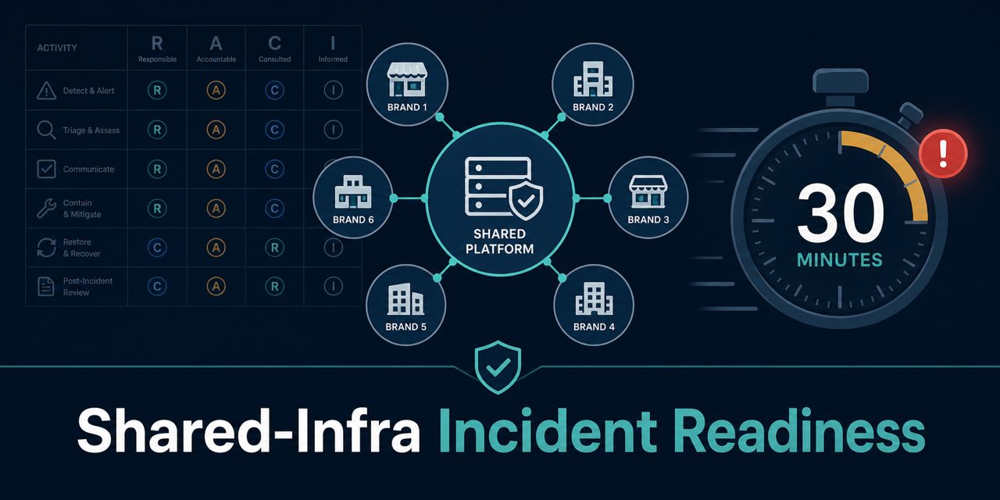

# shared-infra-incident-readiness



[](LICENSE)

> 🇯🇵 日本語版は [README.ja.md](README.ja.md)

A diagnostic tool and extensible framework for **the first 30 minutes of a
shared-infrastructure incident**: who is accountable, which DPA clauses are
missing, whether the notification timeline meets its SLA, and how to run the
Tabletop exercise. Distilled from the **published analysis** of a shared mail
platform incident (an OEM platform shared by six ISPs).

Key features:

1. **Diagnoses your incident readiness** — it mechanically checks responsibility
   boundaries, contract (DPA) clauses and notification SLAs, and returns a
   deterministic verdict.
2. **A machine-readable single source of truth** — the responsibility table,
   RACI, DPA clauses, notification obligations and scenarios are kept as
   definitions that AI agents and CI can consume directly.
3. **Extensible without forking** — each company adds its own roles, items,
   clauses, obligations and scenarios through an overlay.

> **Glossary**: **DPA** (Data Processing Agreement) is the contract between the
> entrusting party (controller) and the processor governing how personal data is
> handled. **RACI** organises responsibility into four roles — Responsible /
> Accountable / Consulted / Informed. **SLA** here means the deadline by which a
> notification must be sent.

> **A note on language**: Documents under `docs/` are written in Japanese (the
> author's working language). This English README is the entry point;
> [README.ja.md](README.ja.md) is the canonical text.

## Quick start (3 minutes)

```bash
git clone https://github.com/suwa-sh/shared-infra-incident-readiness.git
cd shared-infra-incident-readiness
pip install -r requirements.txt

# 1. Score a filled responsibility-boundary matrix
bin/siir check-responsibility examples/responsibility/sample-oem-mail.yaml

# 2. Check DPA clause coverage
bin/siir check-dpa examples/dpa/sample-dpa-answers.yaml

# 3. Validate an incident record + its notification SLA timeline
bin/siir validate-record examples/records/sample-incident.json --level extended

# 4. Render a 3-stage runbook (responsibility table -> runbook -> comms tree)
bin/siir render-runbook examples/responsibility/sample-oem-mail.yaml --scenario rce-6brand

# 5. Render a Tabletop exercise program
bin/siir tabletop --scenario rce-6brand examples/responsibility/sample-oem-mail.yaml

# 6. Validate an overlay (add / strengthen only) and inspect definitions
bin/siir check-overlay examples/overlays/sample-company/extra-clauses.yaml
bin/siir list-definitions
```

Every command returns a deterministic exit code so you can gate CI on it:
**0** ok · **1** partial (yellow: warnings, deferred items, not-yet-sent
notifications) · **2** block (gaps, missing clauses, SLA breach, rejected
overlay) · **3** input error (file missing / parse error).

## Usage workflow

The commands run against *your* data. Copy the files under `examples/` as
templates, edit them with your own values, then run the commands in this order —
from peacetime preparation to incident-time validation.

1. **Prepare** — copy a sample to start your own input file:
   `cp examples/responsibility/sample-oem-mail.yaml my-responsibility.yaml`
2. **Check responsibilities (peacetime)** — fill the `matrix` with your own
   R/A/C/I (write `tbd` for a box you have not decided yet), then
   `bin/siir check-responsibility my-responsibility.yaml`. Fix `BLOCK` rows
   first, then the `REVISE` gray zones.
3. **Check the contract (peacetime)** — mark each clause `present` / `partial` /
   `missing` in a copy of `examples/dpa/sample-dpa-answers.yaml`, then
   `bin/siir check-dpa my-dpa.yaml`.
4. **Prepare runbooks & drills** — generate the deterministic 3-stage runbook and
   the Tabletop program:
   `bin/siir render-runbook my-responsibility.yaml --scenario rce-6brand` and
   `bin/siir tabletop --scenario rce-6brand my-responsibility.yaml`
   (list scenario ids with `bin/siir list-definitions`).
5. **Validate at incident time** — build a real incident record from
   `examples/records/sample-incident.json` and check the notification timeline:
   `bin/siir validate-record my-incident.json --level extended`.
6. **Extend (optional)** — add your own roles / clauses / scenarios via an
   overlay, validated by `bin/siir check-overlay <path>` and applied with
   `--overlay <path>`.

Sample output (`check-responsibility`) — `[OK]` ok / `[..]` revise / `[NG]` block
per row, then an overall verdict:

```text
Target: 共用メール基盤 (6 ISP OEM)
Responsibility readiness: 83%

[OK] RB01 利用者向け窓口・本人通知: OK (ok)
[..] RB04 プレスリリース (共同 / 個別の決定): REVISE (accountability_deferred)
    gray (tbd): oem_operator
[NG] RB12 平時 / 事故時の合同演習主催: BLOCK (unassigned)

Conclusion: BLOCK
```

See [`README.ja.md`](README.ja.md#使い方想定ワークフロー) for sample output of every
command in the workflow.

## Who this is for

| If you are... | Start with... |
|---|---|
| A **PMO / security lead** at an OEM / shared-platform operator | [`docs/01_responsibility_boundary.md`](docs/01_responsibility_boundary.md) — fill your matrix, run `check-responsibility` |
| A **legal / procurement** owner of an outsourcing contract | [`docs/03_dpa_clauses.md`](docs/03_dpa_clauses.md) — check the 10 mandatory DPA clauses |
| An **engineer / SRE** wiring an incident record pipeline | [`schemas/incident-record.schema.json`](schemas/incident-record.schema.json) + [`docs/02_incident_raci_and_sla.md`](docs/02_incident_raci_and_sla.md) |
| A **consultant / proposal author** | All `docs/` + the overlay model — clone, overlay in private, present client-specific scoring |

## What's in this repo

```
shared-infra-incident-readiness/
├── definitions/                 # Machine-readable canonical framework (YAML)
│   ├── responsibility-matrix.yaml      # 12 items x 4 roles (R/A/C/I)
│   ├── incident-raci.yaml              # 15 activities x 5 roles (refs obligations/clauses)
│   ├── dpa-clauses.yaml                # 10 DPA clauses (contractual SLA source of truth)
│   ├── notification-obligations.yaml   # statutory notification clocks
│   └── scenarios.yaml                  # Tabletop scenarios
├── schemas/incident-record.schema.json # incident record + notification timeline
├── bin/siir + src/siir/                # the CLI
├── examples/                           # sample inputs, overlays, worked example, agent skills
├── docs/                               # design docs (C4, concept model, scoring)
└── tests/                              # overlay / scoring / SLA / runbook boundary conditions
```

## The overlay model

Overlays let a company extend the framework without forking it. Only two
operations are allowed, declared per definition in `extension_points`:

- **`add`** — append a new role / item / clause / obligation / scenario (with a
  fresh `id`). Overwriting or deleting existing entries is rejected.
- **`strengthen`** — move a declared numeric field in the stricter direction
  only (e.g. shorten an SLA from 24h to 12h). Weakening is rejected.

`bin/siir check-overlay <path>` validates an overlay before you apply it.

## Development

```bash
pip install -r requirements.txt pytest
pytest tests/                  # boundary conditions, exit codes
bin/siir --help                # CLI smoke
npx md-mermaid-lint docs/*.md  # diagram syntax
```

## License

MIT — see [LICENSE](LICENSE).
