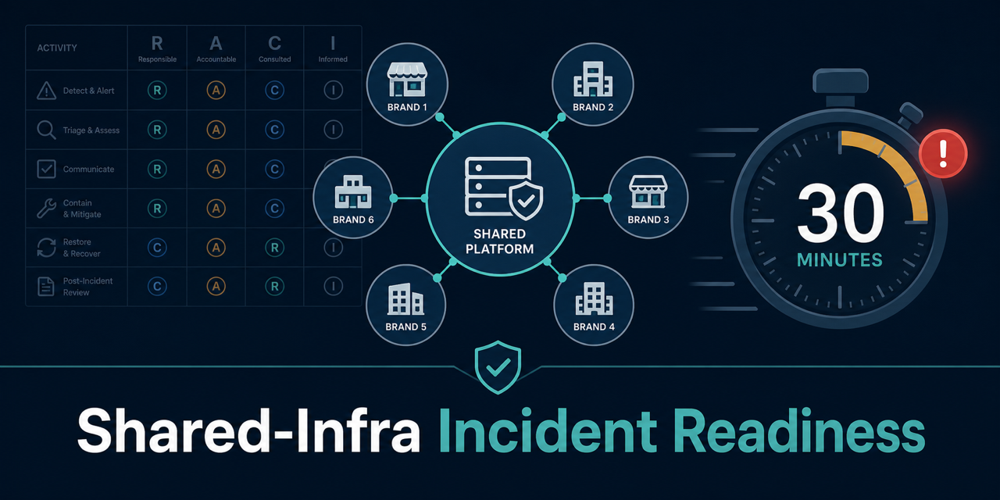

# shared-infra-incident-readiness



[](https://github.com/suwa-sh/shared-infra-incident-readiness/actions/workflows/ci.yml)
[](LICENSE)

> 🇯🇵 日本語版は [README.ja.md](README.ja.md)

A diagnostic tool and extensible framework for **the first 30 minutes of a
shared-infrastructure incident**: who is accountable, which DPA clauses are
missing, whether the notification timeline meets its SLA, and how to run the
Tabletop exercise. Distilled from the **published analysis** of a shared mail
platform incident (an OEM platform shared by six ISPs).

Key features:

1. **Diagnoses your incident readiness** — it mechanically checks responsibility
   boundaries, contract (DPA) clauses and notification SLAs, and returns a
   deterministic verdict.
2. **A machine-readable single source of truth** — the responsibility table,
   RACI, DPA clauses, notification obligations and scenarios are kept as
   definitions that AI agents and CI can consume directly.
3. **Extensible without forking** — each company adds its own roles, items,
   clauses, obligations and scenarios through an overlay.

> **Glossary**: **DPA** (Data Processing Agreement) is the contract between the
> entrusting party (controller) and the processor governing how personal data is
> handled. **RACI** organises responsibility into four roles — Responsible /
> Accountable / Consulted / Informed. **SLA** here means the deadline by which a
> notification must be sent.

> **A note on language**: Documents under `docs/` are written in Japanese (the
> author's working language). This English README is the entry point;
> [README.ja.md](README.ja.md) is the canonical text.

## Quick start (3 minutes)

No setup — pull the published image and run it. The bundled samples work out
of the box:

```bash
docker run --rm --read-only ghcr.io/suwa-sh/shared-infra-incident-readiness:v0.3.0 --version

# 1. Score a filled responsibility-boundary matrix
docker run --rm --read-only ghcr.io/suwa-sh/shared-infra-incident-readiness:v0.3.0 \
  check-responsibility examples/responsibility/sample-oem-mail.yaml

# 2. Check DPA clause coverage
docker run --rm --read-only ghcr.io/suwa-sh/shared-infra-incident-readiness:v0.3.0 \
  check-dpa examples/dpa/sample-dpa-answers.yaml

# 3. Validate an incident record + its notification SLA timeline
docker run --rm --read-only ghcr.io/suwa-sh/shared-infra-incident-readiness:v0.3.0 \
  validate-record examples/records/sample-incident.json --level extended

# 4. Render a 3-stage runbook (responsibility table -> runbook -> comms tree)
docker run --rm --read-only ghcr.io/suwa-sh/shared-infra-incident-readiness:v0.3.0 \
  render-runbook examples/responsibility/sample-oem-mail.yaml --scenario rce-6brand

# 5. Render a Tabletop exercise program
docker run --rm --read-only ghcr.io/suwa-sh/shared-infra-incident-readiness:v0.3.0 \
  tabletop --scenario rce-6brand examples/responsibility/sample-oem-mail.yaml

# 6. Validate an overlay (add / strengthen only) and inspect definitions
docker run --rm --read-only ghcr.io/suwa-sh/shared-infra-incident-readiness:v0.3.0 \
  check-overlay examples/overlays/sample-company/extra-clauses.yaml
docker run --rm --read-only ghcr.io/suwa-sh/shared-infra-incident-readiness:v0.3.0 list-definitions
```

Use `list-definitions --format json --detail` when an agent or integration
needs the effective item text, notes, recommended cells, and role names after
all selected overlays are applied. `--detail` is JSON-only.

`--version` prints the app version and the bundled overlay engine version, e.g.
`siir 0.3.0 (overlay-scoring-skeleton 0.1.0)`.

Every command returns a deterministic exit code so you can gate CI on it:
**0** ok · **1** partial (yellow: warnings, deferred items, not-yet-sent
notifications) · **2** block (gaps, missing clauses, SLA breach, rejected
overlay) · **3** input error (file missing / parse error).

YAML answers and incident records require top-level `schema_version: 1` in the
current source version. JSON output is an envelope with `contract_version`,
reproducibility metadata in `provenance`, and the verdict under `result`.
Consumers must check `contract_version == 1` before reading `result`.

## Usage workflow

The commands run against *your* data. Mount the directory that holds your files
into the container. A shell function keeps the rest of this guide readable:

```bash
siir() { docker run --rm --read-only \
  --mount type=bind,src="$PWD",dst=/data,readonly -w /data \
  ghcr.io/suwa-sh/shared-infra-incident-readiness:v0.3.0 "$@"; }
```

Grab a sample from [`examples/`](examples/) as a template, edit it with your own
values, then run the commands in this order — from peacetime preparation to
incident-time validation.

1. **Prepare** — start your own input files from a sample
   (`my-responsibility.yaml`, `my-dpa.yaml`).
2. **Check responsibilities (peacetime)** — fill the `matrix` with your own
   R/A/C/I (write `tbd` for a box you have not decided yet), then
   `siir check-responsibility my-responsibility.yaml`. Fix `BLOCK` rows
   first, then the `REVISE` gray zones.
3. **Check the contract (peacetime)** — mark each clause `present` / `partial` /
   `missing` in a copy of `examples/dpa/sample-dpa-answers.yaml`, then
   `siir check-dpa my-dpa.yaml`.
4. **Prepare runbooks & drills** — generate the deterministic 3-stage runbook and
   the Tabletop program:
   `siir render-runbook my-responsibility.yaml --scenario rce-6brand` and
   `siir tabletop --scenario rce-6brand my-responsibility.yaml`
   (list scenario ids with `siir list-definitions`).
5. **Validate at incident time** — build a real incident record from
   `examples/records/sample-incident.json` and check the notification timeline:
   `siir validate-record my-incident.json --level extended`.
6. **Extend (optional)** — add your own roles / clauses / scenarios via an
   overlay, validated by `siir check-overlay <path>` and applied with
   `--overlay <path>`.

Sample output (`check-responsibility`) — `[OK]` ok / `[..]` revise / `[NG]` block
per row, then an overall verdict:

```text
Target: 共用メール基盤 (6 ISP OEM)
Responsibility readiness: 83%

[OK] RB01 利用者向け窓口・本人通知: OK (ok)
[..] RB04 プレスリリース (共同 / 個別の決定): REVISE (accountability_deferred)
    gray (tbd): oem_operator
[NG] RB12 平時 / 事故時の合同演習主催: BLOCK (unassigned)

Conclusion: BLOCK
```

See [`README.ja.md`](README.ja.md#自社データで診断する) for the guided workflow
from preparing organisation data to validating an incident record.

## Official overlay — agentic-attacker readiness

Besides your own overlays, the repo ships an official one under
[`overlays/`](overlays/). `overlays/agentic-attacker/` distils four dimensions
from a real incident driven end-to-end by an autonomous AI agent (Hugging Face,
disclosed 2026-07-16) — machine-speed triage, forensic-platform sovereignty,
privilege-boundary chaining, and off-hours paging SLA — into 5 responsibility
items, 3 initial-response activities, and 1 Tabletop scenario.

From a source checkout, reference it with repo-relative paths:

```bash
siir check-responsibility my-answers.yaml \
  --overlay overlays/agentic-attacker/responsibility.yaml
```

With Docker, the bundled overlays live under `/app` inside the image (your own
answers are mounted at `/data`):

```bash
docker run --rm --read-only \
  --mount type=bind,src="$PWD",dst=/data,readonly \
  ghcr.io/suwa-sh/shared-infra-incident-readiness:v0.3.0 \
  check-responsibility /data/my-answers.yaml \
  --overlay /app/overlays/agentic-attacker/responsibility.yaml
```

See [`docs/06_agentic_attacker_overlay.md`](docs/06_agentic_attacker_overlay.md) for details.

## Official overlay — evaluation-containment readiness

`overlays/evaluation-containment/` checks the organisation running a
safety-control-reduced evaluation. It adds 7 responsibility items, 7 ordered
initial-response activities, 4 evaluation-specific roles, a Tabletop scenario,
and an affected-third-party communication branch. It is independent from, and
composable with, the victim-side `agentic-attacker` overlay.

This overlay was added after the `v0.3.0` release. Until the next tag is
published, run it from the current source checkout with `bin/siir` rather than
the released container image.

```bash
python3 -m venv .venv
.venv/bin/pip install -e .
```

Use both responsibility overlays for the bundled answer sample. Use the three
evaluation files plus the agentic responsibility file when rendering the
scenario, so every answer ID, responsibility owner, and activity order resolves:

```bash
bin/siir render-runbook examples/responsibility/sample-evaluation-containment.yaml \
  --scenario evaluation-containment \
  --overlay overlays/evaluation-containment/scenarios.yaml \
  --overlay overlays/evaluation-containment/responsibility.yaml \
  --overlay overlays/evaluation-containment/incident-raci.yaml \
  --overlay overlays/agentic-attacker/responsibility.yaml
```

The bundled answer sample covers both sides of the incident and therefore also
contains victim-side RB20–RB24. The agentic-attacker responsibility overlay is
required to resolve those IDs.

See [`docs/07_evaluation_containment_overlay.md`](docs/07_evaluation_containment_overlay.md)
for the responsibility model, communication deadline override, and primary sources.

## Who this is for

| If you are... | Start with... |
|---|---|
| A **PMO / security lead** at an OEM / shared-platform operator | [`docs/01_responsibility_boundary.md`](docs/01_responsibility_boundary.md) — fill your matrix, run `check-responsibility` |
| A **legal / procurement** owner of an outsourcing contract | [`docs/03_dpa_clauses.md`](docs/03_dpa_clauses.md) — check the 10 mandatory DPA clauses |
| An **engineer / SRE** wiring an incident record pipeline | [`schemas/incident-record.schema.json`](schemas/incident-record.schema.json) + [`docs/02_incident_raci_and_sla.md`](docs/02_incident_raci_and_sla.md) |
| A **consultant / proposal author** | All `docs/` + the overlay model — clone, overlay in private, present client-specific scoring |
| An **operations / audit owner** | [`docs/08_operations_and_data_handling.md`](docs/08_operations_and_data_handling.md) — execution boundaries, evidence, upgrade and rollback |

## What's in this repo

```
shared-infra-incident-readiness/
├── definitions/                 # Machine-readable canonical framework (YAML)
│   ├── responsibility-matrix.yaml      # 12 items x 4 roles (R/A/C/I)
│   ├── incident-raci.yaml              # 15 activities x 5 roles (refs obligations/clauses)
│   ├── dpa-clauses.yaml                # 10 DPA clauses (contractual SLA source of truth)
│   ├── notification-obligations.yaml   # statutory notification clocks
│   └── scenarios.yaml                  # Tabletop scenarios
├── schemas/incident-record.schema.json # incident record + notification timeline
├── overlays/                           # official agentic-attacker and evaluation-containment overlays
├── bin/siir + src/siir/                # the CLI
├── examples/                           # sample inputs, overlays, worked example, agent skills
├── docs/                               # design docs (C4, concept model, scoring)
└── tests/                              # overlay / scoring / SLA / runbook boundary conditions
```

## The overlay model

Overlays let a company extend the framework without forking it. Only two
operations are allowed, declared per definition in `extension_points`:

- **`add`** — append a new role / item / clause / obligation / scenario (with a
  fresh `id`). Overwriting or deleting existing entries is rejected.
- **`strengthen`** — move a declared numeric field in the stricter direction
  only (e.g. shorten an SLA from 24h to 12h). Weakening is rejected.

`siir check-overlay <path>` (using the `siir` shell function from
[Usage workflow](#usage-workflow)) validates an overlay before you apply it.

## Development

```bash
.venv/bin/pytest               # boundary conditions, exit codes
bin/siir --help                # CLI smoke
npm ci                         # exact documentation tool versions
npm run lint:mermaid           # diagram syntax
python scripts/check_docs.py --cli       # links, image tags, documented workflows
python scripts/check_sources.py          # authority coverage and review dates
python scripts/check_docs.py --container # released image and documented /app paths
qlty check --all --no-fix --no-progress --no-upgrade-check
```

Incident inputs can contain confidential data. Minimise and redact them, use
read-only mounts, and protect retained JSON evidence with encryption, least
privilege, and a retention deadline. The CLI itself makes no network calls;
CI, log collectors, and calling AI agents are separate data boundaries. See the
[operations guide](docs/08_operations_and_data_handling.md),
[compatibility policy](COMPATIBILITY.md), [migration guide](MIGRATION.md), and
[support policy](SUPPORT.md).

## License

MIT — see [LICENSE](LICENSE).
