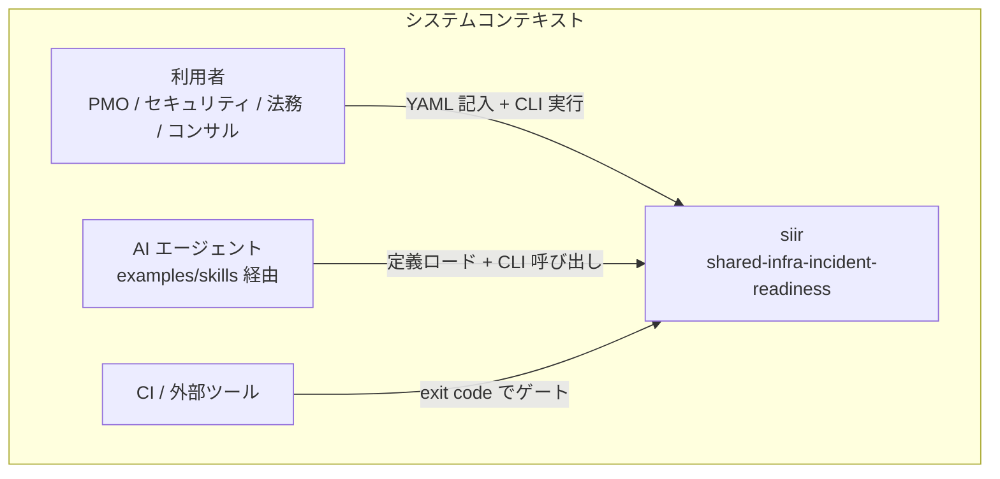
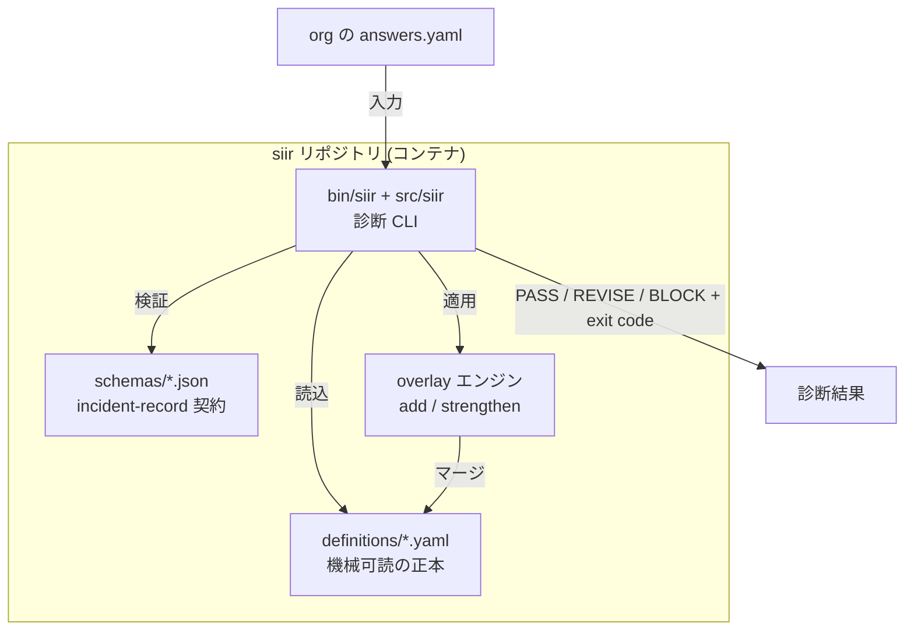
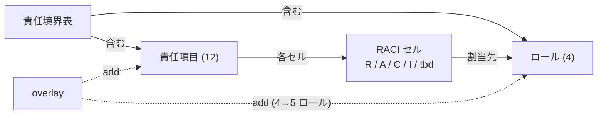
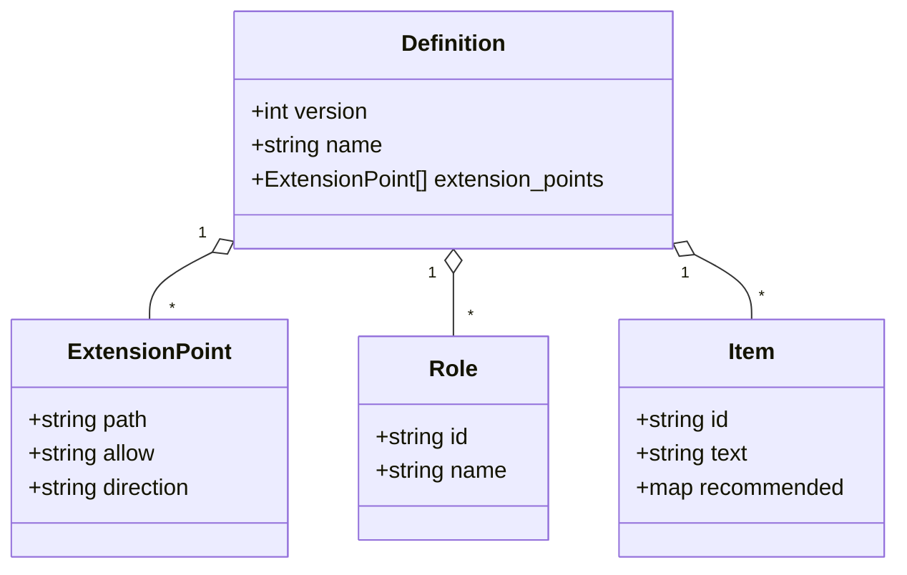

# 01. 責任境界表 — 共有インフラ事故初動の「誰の責任か」

## TL;DR

共有インフラ(OEM / 共通基盤)で事故が起きた最初の 30 分に、「これは誰の責任か」を即決するための **責任境界表 12 項目 × 4 ロール**です。`siir check-responsibility` が各組織の記入済みマトリクスを採点し、未割当 / 説明責任の分裂 / 都度協議(グレーゾーン)を出し分けます。

## When to use this

- 共有 SaaS / OEM 基盤を提供・受託していて、事故初動の責任分界が曖昧なまま走っているとき
- 顧客提案・オンボーディングで「事故初動の備え」を可視化したいとき

## Quick use

```bash
bin/siir check-responsibility examples/responsibility/sample-oem-mail.yaml
# => Conclusion: BLOCK (RB12 未割当)。exit 2
```

## Concept

### システム構造 (C4: コンテキスト → コンテナ)





### 概念モデル (責任境界表のドメイン)



| エンティティ | 説明 |
|---|---|
| 責任境界表 | 12 項目 × 4 ロールの正本 (`definitions/responsibility-matrix.yaml`) |
| 責任項目 | 事故初動で責任主体を決める単位 (例: RB04 プレスリリースの共同/個別決定) |
| ロール | 委託元ISP / OEM基盤運用者 / 運用受託BPO / SaaSベンダー。overlay で利用者列を追加し 5 ロールへ |
| RACI セル | 各 (項目, ロール) の割当。R/A/C/I に加え、未決を明示する `tbd`(都度協議) |

### 情報モデル (定義ファイルの構造 = overlay が拡張する契約)



各 `Item` は推奨割当 `recommended`(記事のテンプレ値)を持ち、組織は answers でこれを写し取って自社用に調整します。`extension_points` は、overlay で何を `add` / `strengthen` できるかを self-documenting に宣言します(→ [02](02_incident_raci_and_sla.md) の SLA 強化、overlay 規則の詳細は [README](../README.ja.md))。

### 採点ロジック (ownership clarity)

記事のテンプレには主担当を単一の **R** で表す行(本人通知・監査ログ等)があり、必ず別の **A** を要求すると原典と矛盾します。そこで「明確な単一オーナー」を合格条件にします。

| 状態 | 判定 | exit |
|---|---|---|
| A が 1 つ、または A 無しで R が 1 つ | ok | — |
| `tbd`(都度協議)を含む | revise(グレーゾーン) | 1 |
| A 無し・R 無し・割当ゼロ | block(未割当) | 2 |
| A が 2 つ以上(説明責任の分裂) | block | 2 |
| A 無しで R が 2 つ以上(オーナー曖昧) | revise | 1 |

`tbd` を罰しないのは、記事が「不明 / 都度協議の箱を残す勇気」を明示的に推奨しているためです。

## References

- 正本: [`definitions/responsibility-matrix.yaml`](../definitions/responsibility-matrix.yaml)
- 実装: [`src/siir/check_responsibility.py`](../src/siir/check_responsibility.py)
- 出典: 共用メール基盤事案の分析(公開報道からの抽出。内部情報には依拠していません)
