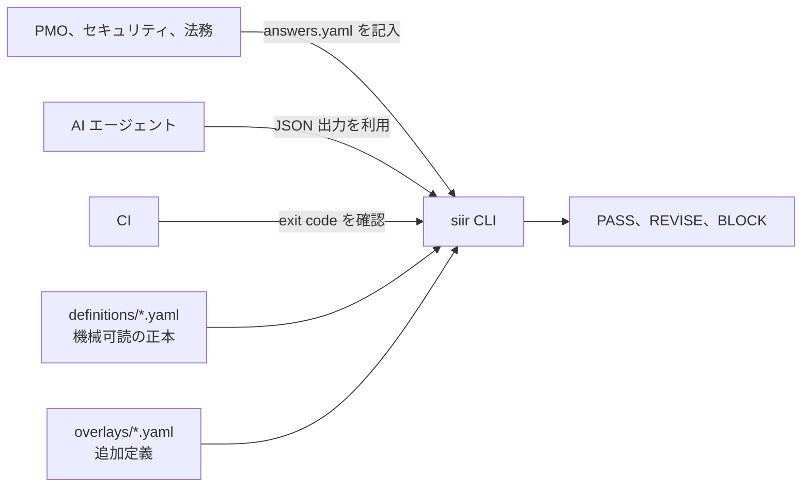
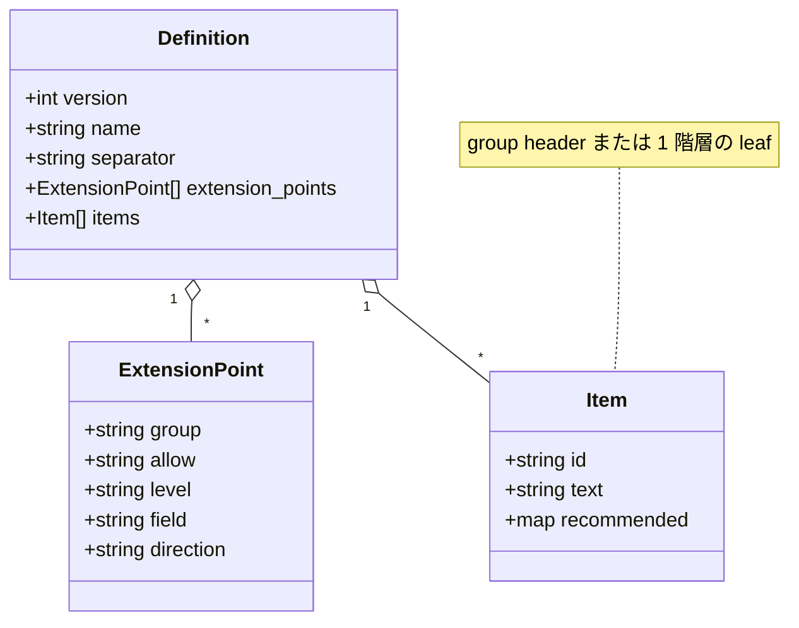

# 01. 共有インフラ事故初動の責任境界

## TL;DR

**責任境界表**は、共有インフラで事故が起きたときに、誰が実施責任と説明責任を負うかを決める表です。
基本定義は、事故初動の 12 項目と 4 ロールで構成します。
`siir check-responsibility` は記入済みの表を採点し、未割当、説明責任の分裂、都度協議を区別して表示します。

## When to use this

- 共有 SaaS や OEM 基盤を提供または運用しており、事故初動の担当が決まっていないとき
- 顧客への提案やオンボーディングで、事故初動の準備状況を確認したいとき
- 組織変更や委託先変更のあとに、責任の空白が生じていないか再点検するとき

## Quick use

同梱の記入例を採点します。

```bash
bin/siir check-responsibility examples/responsibility/sample-oem-mail.yaml
# Conclusion: BLOCK（RB12 が未割当）。exit 2
```

自社で使う場合は、記入例をコピーして `matrix` の RACI セルを書き換えます。
まだ決めていないセルには、空欄ではなく `tbd` を記入します。
空欄では未回答と未決を区別できないためです。

## Concept

### RACI で責任を記録する

**RACI** は、活動ごとの関与を次の 4 種類で表す方法です。

- **Responsible（R）**：作業を実施します。
- **Accountable（A）**：結果について最終的な説明責任を負います。
- **Consulted（C）**：実施前に相談を受けます。
- **Informed（I）**：決定や結果の通知を受けます。

SIIR は `tbd` も受け付けます。
`tbd` は未決事項を隠さず記録するための値であり、解決済みとはみなしません。

### 入力から診断結果までの流れ


```mermaid
flowchart LR
  user["PMO、セキュリティ、法務"] -->|"answers.yaml を記入"| cli["siir CLI"]
  agent["AI エージェント"] -->|"JSON 出力を利用"| cli
  ci["CI"] -->|"exit code を確認"| cli
  defs["definitions/*.yaml<br/>機械可読の正本"] --> cli
  overlays["overlays/*.yaml<br/>追加定義"] --> cli
  cli --> result["PASS、REVISE、BLOCK"]
```

`definitions/responsibility-matrix.yaml` が基本項目と基本ロールの正本です。
組織固有または脅威固有の項目は overlay から追加します。
回答ファイルには、その組織で実際に合意した割当だけを保存します。

### 定義ファイルの構造

定義ファイルは、単一の `items` リストを持ちます。
項目 ID は、グループ見出しか、その直下にある leaf のどちらかです。

- グループ見出し：`roles` や `resp`
- leaf：`roles.principal_isp` や `resp.RB01`

回答、overlay、他定義からの参照では、`RB01` のようにグループ接頭辞を外した ID を使います。
この規則により、CLI は基本定義と overlay を同じ方法で処理できます。


```mermaid
classDiagram
  class Definition {
    +int version
    +string name
    +string separator
    +ExtensionPoint[] extension_points
    +Item[] items
  }
  class ExtensionPoint {
    +string group
    +string allow
    +string level
    +string field
    +string direction
  }
  class Item {
    +string id
    +string text
    +map recommended
  }
  Definition "1" o-- "*" ExtensionPoint
  Definition "1" o-- "*" Item
  note for Item "group header または 1 階層の leaf"
```

各 leaf は、初回記入の参考にできる `recommended` を持てます。
`extension_points` は、overlay が項目を追加できる場所と、数値を厳格化できる方向を宣言します。
overlay の規則は [README.ja.md](../README.ja.md#overlay-で自社ルールを追加する) を参照してください。

### 採点結果を読む

SIIR は、明確な単一の責任者がいるかを項目ごとに判定します。
ここでいう **責任者** は、Accountable が 1 ロール、または Accountable がなく Responsible が 1 ロールの状態です。

| 状態 | 判定 | exit code |
|---|---|---|
| A が 1 つ | `ok` | 0 |
| A がなく、R が 1 つ | `ok` | 0 |
| `tbd` を含む | `revise` | 1 |
| A も R もない | `block` | 2 |
| A が 2 つ以上 | `block` | 2 |
| A がなく、R が 2 つ以上 | `revise` | 1 |

`BLOCK` は実行前に解消すべき責任空白です。
`REVISE` は判断を保留している箇所を示すため、期限と決定者を決めて追跡します。

## References

- 正本：[`definitions/responsibility-matrix.yaml`](../definitions/responsibility-matrix.yaml)
- 記入例：[`examples/responsibility/sample-oem-mail.yaml`](../examples/responsibility/sample-oem-mail.yaml)
- 実装：[`src/siir/check_responsibility.py`](../src/siir/check_responsibility.py)
- 出典：共用メール基盤事案の公開報道を基にした分析
