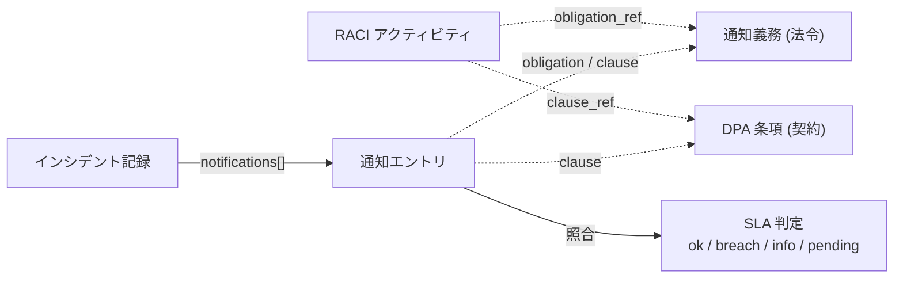

# 02. 初動 RACI と通知 SLA — 二重保持しない期限管理

## TL;DR

事故初動の **15 アクティビティ × 5 ロール**(Day 0-3 の順序)と、混在する通知期限を管理します。RACI は責任を Responsible(実施)/ Accountable(説明責任)/ Consulted(相談)/ Informed(通知)の 4 役割で整理する手法です。契約 SLA(24h/72h)と法令・規制の期限(個情委速報/確報・総務省・本人通知)を**別の正本に分離**し、RACI 側は ID 参照だけを持ちます。`siir validate-record` が、インシデント記録の通知タイムラインを SLA に機械照合します。

## When to use this

- 事故時に「誰が・いつ・どの当局に」通知するかの順序と期限を固めたいとき
- インシデント記録の通知タイムラインが SLA を守れているか検証したいとき

## Quick use

```bash
bin/siir validate-record examples/records/sample-incident.json --level extended
# => DPA03 確報が 102h (>72h SLA) で breach => BLOCK
```

## Concept

### なぜ SLA を 2 ファイルに分けるか

通知期限には性質の違う 2 系統があります。同じ値を 2 箇所に書くと改訂時に片方が腐るため、正本を分けます。

| 系統 | 正本 | 例 |
|---|---|---|
| 契約上の SLA | `dpa-clauses.yaml` | 委託先→委託元 24h 第一報 / 72h 確報、Critical CVE 後 72h 暫定対応 |
| 法令・規制の期限 | `notification-obligations.yaml` | 個情委 速報「速やか」/ 確報 30日、総務省「遅滞なく」、本人通知 |

`incident-raci.yaml` の各アクティビティは SLA 値を持たず、`obligation_ref`(OB*) か `clause_ref`(DPA*)で参照するだけです。これで「単一正本」を守ります。

### 通知義務の概念モデル



### SLA フィールド設計

記事の混在期限(24h・72h・3-5日・30/60日・遅滞なく・連名可否)を決定的に扱うため、各義務は次を持ちます。

| フィールド | 意味 |
|---|---|
| `deadline_anchor` | 起点(awareness=認識時点 / confirmation=確認時点) |
| `duration_hours` | 数値の締切時間。`validate-record` が機械照合します。null なら text のみ |
| `duration_text` | 法令文言(「遅滞なく」「速やか」)。数値化できないものは informational |
| `recipient` | 通知先(本人 / 個情委 / 総務省 / 委託元) |
| `clock_type` | legal / regulatory / practice(実務推奨) |
| `legal_basis` | 根拠条文(個情法26条 / GDPR Art.33 / 電通法28条) |
| `joint_report_allowed` | 連名報告可否(個情委 FAQ Q5-17-16) |

数値締切(24h/72h/30日/不正目的60日=OB02b)は breach を hard に判定して `BLOCK` にします。非数値(「遅滞なく」)は手動レビュー対象として info に落とし、誤った合否判定をしません。

**過剰な断定を避ける**: 個情委速報の「速やか」の運用日数は公式の明示がありません(記事 U5 で未確認)。そこで OB01 は `duration_hours: null` + `confidence: unconfirmed` とし、機械照合せず info に落とします。各社は overlay の `strengthen` で自社基準の数値締切を入れます。

**確報の段階**: DPA03 のように第一報(24h)と確報(72h)で SLA が違う条項では、記録の通知エントリに `stage: first|confirmed` を付けて照合先を切り替えます(確報を 24h で誤判定しません)。

## References

- 正本: [`definitions/incident-raci.yaml`](../definitions/incident-raci.yaml) / [`definitions/notification-obligations.yaml`](../definitions/notification-obligations.yaml)
- スキーマ: [`schemas/incident-record.schema.json`](../schemas/incident-record.schema.json)
- 実装: [`src/siir/validate_record.py`](../src/siir/validate_record.py)
