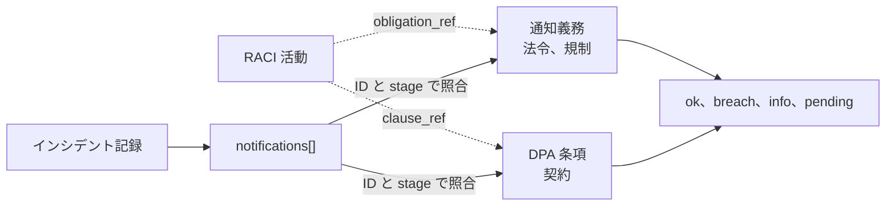

# 02. 初動 RACI と通知期限の管理

## TL;DR

SIIR は、事故初動の 15 活動と 5 ロールを RACI で管理します。
契約上の通知期限と、法令または規制上の通知期限は、異なる定義ファイルに保存します。
`siir validate-record` は、インシデント記録の通知時刻を数値化できる期限と照合します。

## When to use this

- 事故時に誰が、どの通知先へ、いつまでに連絡するかを決めたいとき
- インシデント記録の通知時刻が契約上の期限を守っているか検証したいとき
- 契約期限と法令期限を別々に改訂できるようにしたいとき

## Quick use

同梱のインシデント記録を検証します。

```bash
bin/siir validate-record examples/records/sample-incident.json --level extended
# DPA03 の確報が 102 時間後で、72 時間の期限を超えるため BLOCK
```

## Concept

### 期限を二つの正本に分ける

**SLA（Service Level Agreement）**は、この文書では通知や対応を完了するまでの契約上の期限を指します。
契約上の SLA と法令上の期限は、根拠と改訂主体が異なります。
同じ値を複数のファイルに書くと改訂漏れが起きるため、SIIR は正本を分けます。

| 期限の種類 | 正本 | 例 |
|---|---|---|
| 契約上の SLA | `definitions/dpa-clauses.yaml` | 委託先から委託元への第一報と確報 |
| 法令または規制上の期限 | `definitions/notification-obligations.yaml` | 個情委への速報と確報、総務省への報告、本人通知 |

`definitions/incident-raci.yaml` は期限値を持ちません。
各活動は `obligation_ref` または `clause_ref` で正本の ID を参照します。


```mermaid
graph LR
  activity["RACI 活動"] -.->|"obligation_ref"| obligation["通知義務<br/>法令、規制"]
  activity -.->|"clause_ref"| clause["DPA 条項<br/>契約"]
  record["インシデント記録"] --> entry["notifications[]"]
  entry -->|"ID と stage で照合"| obligation
  entry -->|"ID と stage で照合"| clause
  obligation --> verdict["ok、breach、info、pending"]
  clause --> verdict
```

### 通知期限を表すフィールド

| フィールド | 意味 |
|---|---|
| `deadline_anchor` | 期限を数え始める時点であり、`awareness` は認識時点、`confirmation` は確認時点を表します。 |
| `duration_hours` | CLI が照合する時間数であり、`null` の場合は自動で合否を決めません。 |
| `duration_text` | 「遅滞なく」や「速やか」など、数値化しない期限表現です。 |
| `recipient` | 本人、個情委、総務省、委託元などの通知先です。 |
| `clock_type` | `legal`、`regulatory`、`practice` のどれに基づく期限かを示します。 |
| `legal_basis` | 根拠となる条文や資料です。 |
| `joint_report_allowed` | 連名で報告できるかを示します。 |

`duration_hours` がある期限を超えた場合、`validate-record` は `BLOCK` を返します。
「遅滞なく」のように数値化していない期限は、根拠なく合否を決めず、手動確認が必要な `info` として返します。

個情委への速報に使われる「速やか」は、定義内で時間数を固定していません。
そのため、該当する通知義務は `duration_hours: null` とし、自社基準を設ける場合だけ overlay で時間数を厳格化します。

### 第一報と確報を区別する

同じ DPA 条項が第一報と確報に異なる期限を持つ場合があります。
インシデント記録では、通知エントリの `stage` に `first` または `confirmed` を指定します。
CLI は `stage` を使って対応する期限を選ぶため、確報を第一報の期限で誤判定しません。

## References

- 初動 RACI の正本：[`definitions/incident-raci.yaml`](../definitions/incident-raci.yaml)
- 通知義務の正本：[`definitions/notification-obligations.yaml`](../definitions/notification-obligations.yaml)
- 契約 SLA の正本：[`definitions/dpa-clauses.yaml`](../definitions/dpa-clauses.yaml)
- スキーマ：[`schemas/incident-record.schema.json`](../schemas/incident-record.schema.json)
- 実装：[`src/siir/validate_record.py`](../src/siir/validate_record.py)
