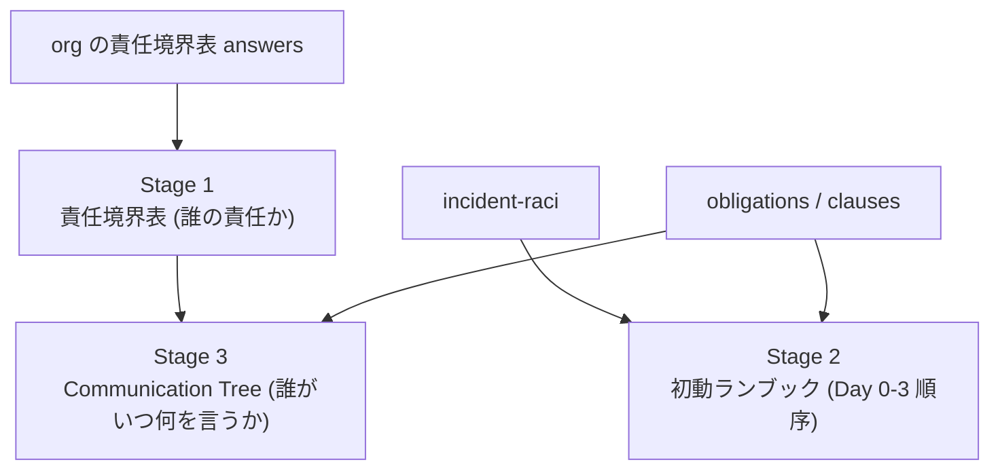
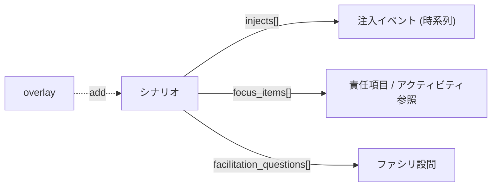

# 04. Tabletop 演習と初動ランブック — 表を「動く紙」にする

## TL;DR

責任境界表は静的な表のままでは形骸化します。記事の「表 → Runbook → Communication Tree の三段」を機械的に展開し、**初動ランブック**(`siir render-runbook`)と **Tabletop 演習プログラム**(`siir tabletop`)を決定的に生成します。自由生成(LLM)ではなく、同じ入力からは常に同じ出力が出るので、レビューや差分管理ができます。

## When to use this

- 責任境界表を年1回 Tabletop で叩いて形骸化を防ぎたいとき
- 事故時に開く初動ランブックと Communication Tree を平時に用意したいとき

## Quick use

```bash
bin/siir render-runbook examples/responsibility/sample-oem-mail.yaml --scenario rce-6brand
bin/siir tabletop --scenario rce-6brand examples/responsibility/sample-oem-mail.yaml
```

## Concept

### 三段構造 (render-runbook)



- **Stage 1** は組織の記入済みセルを使い、空欄は推奨テンプレ(`recommended`)にフォールバックします(出典列に `org` / `recommended` を明示します)。
- **Stage 2** は incident-raci の順序に SLA(obligation/clause から解決)を当て、シナリオの focus 項目に `*` を付けます。
- **Stage 3** は通知義務から宛先別の分岐(利用者 / 報道 / 個情委 / 総務省)を組み立て、各分岐に主体と期限を当てます。

### シナリオは機械可読 (拡張口)

Tabletop のシナリオはハードコードではなく、`definitions/scenarios.yaml` の機械可読定義です。同梱の `rce-6brand`(共有 SW の RCE → 6 ブランド同時公表)は、注入イベント(時系列)・ファシリ設問・focus 項目を持ちます。自社シナリオは overlay の `add` で追加できます。



answers を渡すと focus 項目に自社の Accountable / 都度協議が注記され、汎用テンプレでなく**自社の表**を叩く演習になります。

### 反証 — 演習が "theater" 化しないために

机上演習は、外部監査人を入れないと形式化します。本ランブックは「最初の 30 分を救う最小装備」であって銀の弾丸ではありません。多層防御・初動ランブック連携・グレーゾーン明記とセットで運用します。

## References

- 正本: [`definitions/scenarios.yaml`](../definitions/scenarios.yaml)
- 実装: [`src/siir/render_runbook.py`](../src/siir/render_runbook.py) / [`src/siir/tabletop.py`](../src/siir/tabletop.py)
