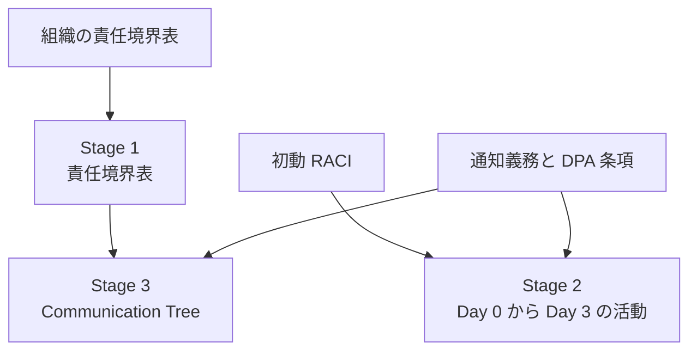
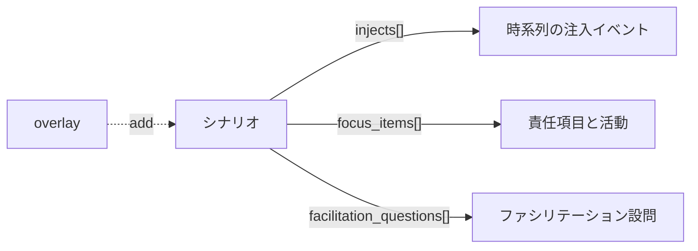

# 04. Tabletop 演習と初動ランブック

## TL;DR

`siir render-runbook` は、責任境界表とシナリオから 3 段構成の初動ランブックを生成します。
`siir tabletop` は、同じ定義から Tabletop 演習の進行表を生成します。
どちらも自由生成を使わないため、同じ入力から同じ Markdown または JSON を再現できます。

## When to use this

- 記入済みの責任境界表を、事故時に実行できる手順へ変換したいとき
- Tabletop 演習で、未決の責任者や通知期限を確認したいとき
- ランブックを差分管理し、組織変更後に再生成したいとき

## Quick use

同梱シナリオから、初動ランブックと演習進行表を生成します。

```bash
bin/siir render-runbook \
  examples/responsibility/sample-oem-mail.yaml \
  --scenario rce-6brand

bin/siir tabletop \
  --scenario rce-6brand \
  examples/responsibility/sample-oem-mail.yaml
```

利用できるシナリオ ID は `bin/siir list-definitions` で確認できます。

## Concept

### 初動ランブックの 3 段構成


```mermaid
graph TB
  answers["組織の責任境界表"] --> stage1["Stage 1<br/>責任境界表"]
  raci["初動 RACI"] --> stage2["Stage 2<br/>Day 0 から Day 3 の活動"]
  obligations["通知義務と DPA 条項"] --> stage2
  stage1 --> stage3["Stage 3<br/>Communication Tree"]
  obligations --> stage3
```

- **Stage 1**：回答ファイルの RACI セルを表示します。
  空欄のセルは定義の `recommended` を使い、出典を `org` または `recommended` として明示します。
- **Stage 2**：初動 RACI を順序どおりに並べ、参照先の通知期限を表示します。
  シナリオが重点項目として指定した活動には印を付けます。
- **Stage 3**：利用者、報道、規制当局など、通知先ごとの分岐を表示します。
  各分岐には主体、発火条件、期限、伝える範囲を含めます。

### Tabletop シナリオの構造

シナリオは `definitions/scenarios.yaml` に保存します。
同梱の `rce-6brand` は、共有ソフトウェアの **RCE（Remote Code Execution、遠隔コード実行）**から複数ブランドの同時公表へ進む事案を扱います。


```mermaid
graph LR
  scenario["シナリオ"] -->|"injects[]"| injects["時系列の注入イベント"]
  scenario -->|"focus_items[]"| focus["責任項目と活動"]
  scenario -->|"facilitation_questions[]"| questions["ファシリテーション設問"]
  overlay["overlay"] -.->|"add"| scenario
```

回答ファイルを渡すと、重点項目には組織の Accountable、または単独の Responsible が表示されます。
したがって、演習では一般的な正解を確認するのではなく、自社で合意した分担が実際に機能するかを確認できます。

### 形式的な演習を避ける

「ランブックを生成すれば初動能力を保証できる」という意味ではありません。
生成物は、最初の 30 分に必要な分担と連絡を確認するための最小構成です。
演習では、判断に使う証拠、連絡手段、代替担当、技術的な封じ込め手段まで実際に確認します。

## References

- シナリオの正本：[`definitions/scenarios.yaml`](../definitions/scenarios.yaml)
- 初動 RACI の正本：[`definitions/incident-raci.yaml`](../definitions/incident-raci.yaml)
- ランブック実装：[`src/siir/render_runbook.py`](../src/siir/render_runbook.py)
- Tabletop 実装：[`src/siir/tabletop.py`](../src/siir/tabletop.py)
