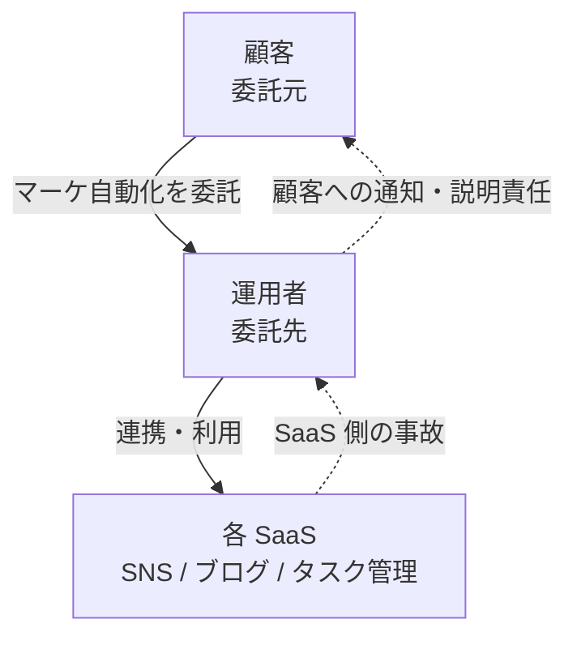

# 05. Worked example — SaaS 委託先としての責任分界を 1 度埋める

## TL;DR

複数顧客から SaaS 連携(SNS スケジューラ / ブログ / タスク管理 等)を委託される**マーケ自動化運用者**を題材に、共有インフラ責任モデルの三層へ写像した記入例です。「自分が委託先として何を SLA 化すべきか」を 1 度埋めて明文化する worked example です。

## When to use this

- 自社が「委託先(運用者)」側で、何を SLA 化・通知すべきか整理したいとき
- 三層構造(委託元 / 運用者 / SaaS)への写像のしかたを具体例で見たいとき

## Quick use

```bash
bin/siir check-responsibility examples/saas-operator/saas-operator-delegation.yaml
# => Conclusion: PASS (全 12 項目に明確な単一オーナー)
```

## Concept

### 三層への写像

| 本リポのロール | この例での主体 |
|---|---|
| 委託元ISP (principal_isp) | 顧客(マーケ自動化を委託する事業者) |
| OEM基盤運用者 (oem_operator) | 運用者(連携基盤・自動化ジョブの運用主体 = 委託先) |
| 運用受託BPO (ops_bpo) | 運用者の下請け / 自動化ジョブ運用 |
| SaaSベンダー (sw_vendor) | 各 SaaS(SNS スケジューラ / ブログ / タスク管理 等) |



### この例から読み取ること

- 運用者は **委託先** なので、SaaS 側で事故が起きたときに顧客へ何を・いつ通知するかの責任(RB01/RB02/RB11)を負います。
- 鍵・ハッシュ管理(RB06)は運用者が Accountable、実装は SaaS が Responsible という分担になります。
- この表を埋めておくと、SaaS インシデント時に「自分が委託先として何を SLA 化すべきか」(委託元への第一報 SLA = DPA03)が事故前に見えてきます。

`check-responsibility` で PASS するのは、全項目に説明責任の分裂や未割当が無く、明確な単一オーナーが置かれているためです(→ 採点ロジックは [01](01_responsibility_boundary.md))。

## References

- 記入例: [`examples/saas-operator/saas-operator-delegation.yaml`](../examples/saas-operator/saas-operator-delegation.yaml)
