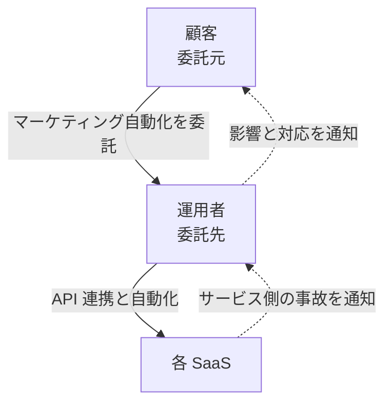

# 05. SaaS 委託先の責任分界を記入する

## TL;DR

この例は、複数顧客のマーケティング自動化を運用する事業者を、共有インフラの責任モデルへ対応付けます。
運用者、顧客、利用する SaaS の分担を 12 項目へ記入し、`check-responsibility` で採点します。
自社が委託先として負う通知と説明の責任を確認したい場合に使えます。

## When to use this

- 自社が委託先として SaaS 連携や自動化処理を運用しているとき
- 顧客、運用者、SaaS ベンダーの三者を基本ロールへ対応付けたいとき
- 顧客への通知内容と通知期限を事故前に整理したいとき

## Quick use

記入済みの例を採点します。

```bash
bin/siir check-responsibility \
  examples/saas-operator/saas-operator-delegation.yaml
# 12 項目すべてに単一の責任者がいるため PASS
```

## Concept

### 基本ロールへの対応付け

| SIIR の基本ロール | この例の主体 |
|---|---|
| 委託元 ISP（`principal_isp`） | マーケティング自動化を委託する顧客 |
| OEM 基盤運用者（`oem_operator`） | 連携基盤と自動化ジョブを運用する事業者 |
| 運用受託 BPO（`ops_bpo`） | 運用者の再委託先またはジョブ運用担当 |
| SaaS ベンダー（`sw_vendor`） | SNS、ブログ、タスク管理などの各サービス提供者 |

この対応付けは、法的な立場が完全に同じだという意味ではありません。
事故初動で担う作業と説明責任が近いロールへ、各主体を割り当てた例です。


```mermaid
graph TB
  customer["顧客<br/>委託元"] -->|"マーケティング自動化を委託"| operator["運用者<br/>委託先"]
  operator -->|"API 連携と自動化"| saas["各 SaaS"]
  saas -.->|"サービス側の事故を通知"| operator
  operator -.->|"影響と対応を通知"| customer
```

### 記入結果を読む

運用者は、顧客に対する窓口、事故通知、説明の担当を引き受けます。
この例では、該当する責任を RB01、RB02、RB11 に記録しています。

鍵とパスワードハッシュの管理では、運用者を Accountable、SaaS ベンダーを Responsible としています。
運用者が顧客への説明責任を持ち、SaaS ベンダーがサービス内部の実装と作業を担う分担です。

全項目が `PASS` になる理由は、すべての項目に単一の責任者がいるためです。
この結果は、技術対策や通知手段の実効性まで保証するものではありません。
採点条件は [01. 共有インフラ事故初動の責任境界](01_responsibility_boundary.md#採点結果を読む) を参照してください。

### 次に確認する契約

責任境界表を埋めると、契約で期限を定めるべき通知が明確になります。
この例では、委託先である運用者から顧客への第一報期限を DPA03 で確認します。
条項の記入方法は [03. 共有基盤の委託契約に必要な DPA 10 条項](03_dpa_clauses.md) を参照してください。

## References

- 記入例：[`examples/saas-operator/saas-operator-delegation.yaml`](../examples/saas-operator/saas-operator-delegation.yaml)
- 責任境界の正本：[`definitions/responsibility-matrix.yaml`](../definitions/responsibility-matrix.yaml)
