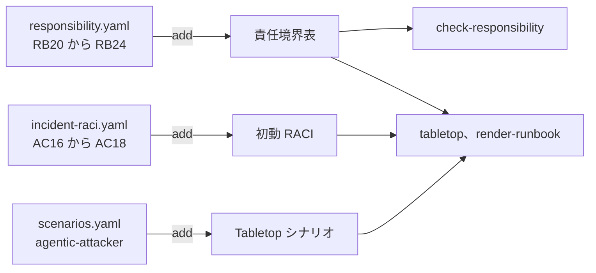

# 06. agentic-attacker overlay

## TL;DR

**agentic-attacker overlay** は、自律 AI エージェントが駆動する侵入事案に備える責任を追加します。
責任項目 5 件（RB20 から RB24）、初動活動 3 件（AC16 から AC18）、Tabletop シナリオ 1 本で構成します。
基本定義の 12 項目は変更せず、overlay の `add` だけを使います。

## When to use this

- 機械速度で進む侵入に、既存の初動体制が対応できるか確認したいとき
- 商用 AI API が有事のフォレンジック解析を拒否する場合に、代替手段の責任者を決めたいとき
- 夜間や休日に重大シグナルを検知した場合のページングを演習したいとき
- 一つのワーカーから認証情報や他クラスタへ侵害が広がる経路を点検したいとき

## Quick use

責任項目だけを採点する場合は、責任定義の overlay を指定します。

```bash
bin/siir check-responsibility \
  examples/responsibility/sample-agentic.yaml \
  --overlay overlays/agentic-attacker/responsibility.yaml
```

Tabletop またはランブックを生成する場合は、3 ファイルをすべて指定します。

```bash
bin/siir tabletop \
  --scenario agentic-attacker \
  examples/responsibility/sample-agentic.yaml \
  --overlay overlays/agentic-attacker/scenarios.yaml \
  --overlay overlays/agentic-attacker/responsibility.yaml \
  --overlay overlays/agentic-attacker/incident-raci.yaml
```

Docker イメージ内の公式 overlay は `/app/overlays/` にあります。
自社の回答ファイルは `/data` にマウントします。

```bash
docker run --rm --read-only --mount type=bind,src="$PWD",dst=/data,readonly \
  ghcr.io/suwa-sh/shared-infra-incident-readiness:v1.0.0 \
  check-responsibility /data/my-answers.yaml \
  --overlay /app/overlays/agentic-attacker/responsibility.yaml
```

## Concept

### 出典事案から抽出した四つの責任

Hugging Face の一次報告は、悪意あるデータセットを起点とするコード実行から、権限昇格、認証情報の窃取、複数クラスタへの横移動までを記録しています。
本 overlay は事案固有の侵入口を除き、初動責任として再利用できる次の四つの構造を扱います。

| 構造 | 初動で確認すること | 追加項目 |
|---|---|---|
| 機械速度の初動 | 大量のイベントを人手だけで追わず、一次トリアージと封じ込め判断を誰が担うか | RB20、AC16 |
| フォレンジック基盤の主権 | 商用 API が解析を拒否した場合の代替基盤を誰が準備し、攻撃者データの境界を誰が管理するか | RB21、RB22、AC17 |
| 権限境界の連鎖 | ワーカー、ノード、クラスタの各境界で、侵害拡大を止める責任を誰が持つか | RB23 |
| 手薄時間帯の初動 SLA | 曜日や時間帯を問わず、重大シグナルを誰へ何分以内に通知するか | RB24、AC18 |

### 三つの overlay ファイル

overlay は、1 ファイルにつき一つの基本定義を拡張します。
`tabletop`、`render-runbook`、`list-definitions` は、各ファイルの `extends` を読み、適用先へ振り分けます。



### 採点と演習の役割を分ける

`check-responsibility` が採点するのは、各責任の責任者が決まっているかどうかです。
フォレンジック基盤やページング機構が実際に動くかまでは採点しません。

たとえば、RB21 に `tbd` があれば、代替フォレンジック基盤を準備し維持する責任者が未決です。
一方、基盤の最終検証日、切替所要時間、必要計算資源は、Tabletop の設問と実地確認で検証します。

### 単一事例から一般化しない

この overlay の出典は一つのインシデントです。
データセット処理パイプラインという侵入口は、すべての共有インフラに当てはまりません。

そのため、責任項目は機械速度、解析基盤、権限境界、手薄時間帯という構造に限定しています。
侵入口や時系列などの事案固有情報は、Tabletop シナリオに保存します。
この overlay は、多層防御や実地演習を代替しません。

## References

- 正本：[`overlays/agentic-attacker/`](../overlays/agentic-attacker/)
- 記入例：[`examples/responsibility/sample-agentic.yaml`](../examples/responsibility/sample-agentic.yaml)
- 一次資料：[Security incident disclosure, July 2026](https://huggingface.co/blog/security-incident-july-2026)
- 採点方法：[01. 共有インフラ事故初動の責任境界](01_responsibility_boundary.md)
- 演習方法：[04. Tabletop 演習と初動ランブック](04_tabletop_and_runbook.md)
