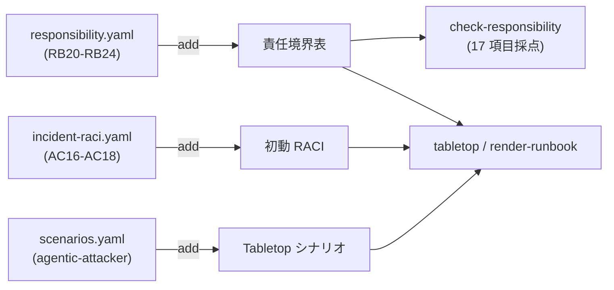

# 06. agentic-attacker overlay — AI 攻撃者時代の readiness を測る

## TL;DR

攻撃が**自律 AI エージェント**で駆動されると、「人間の攻撃者」を暗黙の前提にした事故初動 readiness では測れない準備が 4 つ生まれます。本 overlay は Hugging Face の一次インシデント報告(2026-07-16 公開)からその 4 次元を抽出し、責任項目 5 件(RB20〜RB24)・初動活動 3 件(AC16〜AC18)・Tabletop シナリオ 1 本として siir の診断に追加します。既存の 12 項目の採点は一切変わりません(add のみ、上書きなし)。

## When to use this

- 「攻撃者が AI で自走する事案に、うちの初動体制は耐えるか」を既存の責任境界診断に載せて測りたいとき
- 商用 AI API のガードレールが**有事のフォレンジック解析を拒否する**「非対称性問題」への備えを、責任として誰が持つか決めたいとき
- 週末・夜間の手薄な時間帯を突く機械速度の攻撃を、Tabletop 演習で叩きたいとき

## Quick use

ソース checkout の場合(リポジトリ直下で実行):

```bash
# 診断: 自組織の記入表に AI 攻撃者 readiness の 5 項目を足して採点する
bin/siir check-responsibility examples/responsibility/sample-agentic.yaml \
  --overlay overlays/agentic-attacker/responsibility.yaml

# 演習: 商用 API の解析拒否分岐を含む Tabletop プログラムを生成する
bin/siir tabletop --scenario agentic-attacker examples/responsibility/sample-agentic.yaml \
  --overlay overlays/agentic-attacker/scenarios.yaml \
  --overlay overlays/agentic-attacker/responsibility.yaml \
  --overlay overlays/agentic-attacker/incident-raci.yaml
```

Docker の場合(同梱 overlay はイメージ内の `/app` 配下にあります。自組織の answers は `/data` にマウントしたものを使います):

```bash
docker run --rm -v "$PWD:/data" ghcr.io/suwa-sh/shared-infra-incident-readiness \
  check-responsibility /data/my-answers.yaml \
  --overlay /app/overlays/agentic-attacker/responsibility.yaml
```

## Concept

### 4 次元と追加項目の対応

出典事案では、悪意あるデータセットを起点に処理ワーカーでコードが実行され、ノード権限昇格 → 認証情報窃取 → 週末をまたぐ複数クラスタへの横移動が**すべて自律エージェントの機械速度**で進行しました。防御側が学ぶべき構造は次の 4 次元です。

| 次元 | 何が新しいか | 追加する診断項目 |
|---|---|---|
| 1. 機械速度の初動 | 数千アクション・1 万件超のイベントは人手トリアージ不可。AI による一次トリアージが前提になる | RB20 / AC16 |
| 2. フォレンジック基盤の主権 | 商用 AI API のガードレールは対応者と攻撃者を区別できず、攻撃アーティファクトを含む正当な解析要求をブロックする。商用に依存しない解析基盤の平時準備と、攻撃者データを境界外に出さない統制が要る | RB21・RB22 / AC17 |
| 3. 権限境界の連鎖 | 1 ワーカーの侵害がどこで止まるかは設計で決まる(隔離実行・admission control・短命トークン・セグメンテーション) | RB23 |
| 4. 手薄時間帯の初動 SLA | 横移動は週末を突いた。重大シグナルは曜日を問わず数分でページングされる体制が要る | RB24 / AC18(失効)|

このうち次元 2 が最も非自明で、既存の readiness 系フレームワークがほぼ持っていない観点です。

### overlay の構成と適用先

overlay は 1 ファイル = 1 定義への差分です。複数定義を読むコマンド(tabletop / render-runbook / list-definitions)は、各 overlay の `extends` を見て適用先の定義へ自動で振り分けます。



### 採点が測るもの・測らないもの

siir の `check-responsibility` は「その責任の **owner が明確に割当てられているか**」を採点します(RACI の健全性)。基盤・能力そのものの有無は採点しません。

- `tbd`(都度協議)は「owner が未確定」を意味します。例: RB21 が `tbd` = 主権フォレンジック基盤を**誰が**準備・維持するか決まっていない
- 能力の準備状況(検証日・切替所要時間・必要計算資源)は、Tabletop シナリオ `agentic-attacker` のファシリテーション設問で**証跡として**確認します。採点と演習で役割を分けています

### 反証 — 単一事例からの一般化に注意

本 overlay の出典は単一インシデントです。出典事案の侵入口(データセット処理パイプライン)は AI プラットフォーム特有で、あらゆる共有インフラにそのまま当てはまるわけではありません。そのため各項目は「機械速度 / 解析基盤の主権 / 権限境界の連鎖 / 手薄時間帯」という**構造**の側で書き、事案の具体は Tabletop シナリオ側に置いています。overlay を当てても、多層防御・演習・グレーゾーン明記(`tbd`)とセットで運用してください。

## References

- 正本: [`overlays/agentic-attacker/`](../overlays/agentic-attacker/)(responsibility / incident-raci / scenarios の 3 ファイル)
- 記入例: [`examples/responsibility/sample-agentic.yaml`](../examples/responsibility/sample-agentic.yaml)
- 出典(一次情報): [Security incident disclosure — July 2026 (Hugging Face 公式ブログ)](https://huggingface.co/blog/security-incident-july-2026)
- 採点の仕組み: [`01_responsibility_boundary.md`](01_responsibility_boundary.md) / 演習: [`04_tabletop_and_runbook.md`](04_tabletop_and_runbook.md)
