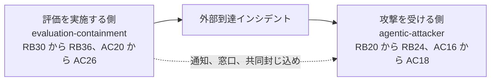

# 07. evaluation-containment overlay

## TL;DR

**evaluation-containment overlay** は、安全制御を弱めた能力評価を実施する組織の責任を点検します。
評価開始の承認から、停止、外部被害の封じ込め、証拠保全、影響確定、第三者対応までを一つの責任モデルで扱います。
責任項目 7 件（RB30 から RB36）、初動活動 7 件（AC20 から AC26）、Tabletop シナリオ 1 本で構成します。

## When to use this

- 本番環境の安全制御（production safeguard）や拒否制御を弱めて、高リスク能力を測る評価を実施するとき
- 隔離環境（sandbox）に外向き通信（egress）、パッケージ取得用プロキシ、外部 API などの許可経路があるとき
- 評価が外部システムへ到達した場合に、停止、調査、第三者連絡の責任者を決めたいとき
- 評価開始前に、封じ込め責任の未割当を検出したいとき

この overlay は評価を実施する側を扱います。
攻撃を受ける側の初動を扱う `agentic-attacker` overlay とは独立しており、同じ事故を両側から演習する場合は併用します。

## Quick use

責任項目だけを採点する場合は、責任定義の overlay を指定します。

```bash
bin/siir check-responsibility \
  examples/responsibility/sample-evaluation-containment.yaml \
  --overlay overlays/evaluation-containment/responsibility.yaml
```

Tabletop またはランブックを生成する場合は、3 ファイルをすべて指定します。

```bash
bin/siir render-runbook \
  examples/responsibility/sample-evaluation-containment.yaml \
  --scenario evaluation-containment \
  --overlay overlays/evaluation-containment/scenarios.yaml \
  --overlay overlays/evaluation-containment/responsibility.yaml \
  --overlay overlays/evaluation-containment/incident-raci.yaml
```

シナリオファイルだけでは、RB30 から RB36 の責任者と、AC20 から AC26 の順序を解決できません。
参照先がない場合、`render-runbook` は入力エラーで終了します。

## Concept

### 四つの評価専用ロール

| 評価専用ロール | 担う判断 | 既存ロールへ対応させる例 |
|---|---|---|
| 評価プログラム責任者 | 評価目的と残余リスクを踏まえた開始承認 | 委託元 ISP またはプログラム sponsor |
| 評価実施者 | 評価操作、停止、隔離、証拠収集 | OEM 運用者または運用 BPO |
| 評価セキュリティ責任者 | 封じ込めの受入、強制停止権限（kill authority）、外部影響調査 | OEM 運用者の security lead |
| 第三者対応責任者 | 影響先への通知、窓口の確立、共同対応の調整 | incident commander、法務、渉外担当 |

組織内の役職名と評価専用ロールは、一対一で対応するとは限りません。
一人が複数ロールを担う場合も、責任項目ごとの Accountable と Responsible は明示します。

第三者対応責任者が自動的に証拠保全を担うわけではありません。
RB34 の証拠保全と、証拠を開示してよいかという判断は別の責任です。

| 責任項目 | 内容 | 推奨 Accountable |
|---|---|---|
| RB30 | 安全制御を弱める評価の開始承認 | 評価プログラム責任者 |
| RB31 | tooling、host、network、全 egress、例外、依存 chokepoint を含む封じ込め資料の受入 | 評価セキュリティ責任者 |
| RB32 | 監視、停止条件、kill authority | 評価セキュリティ責任者 |
| RB33 | 評価実施側での外部被害の封じ込め | 評価セキュリティ責任者 |
| RB34 | 評価環境と調査証拠の保全 | 評価セキュリティ責任者 |
| RB35 | 外部影響範囲の確定 | 評価セキュリティ責任者 |
| RB36 | 第三者への通知、連絡窓口、共同対応の調整 | 第三者対応責任者 |

### 同じ事故を両側から演習する

OpenAI の 2026 年 7 月 21 日の開示は、production classifier を外した内部評価から、package registry cache proxy を経て外部到達が生じた事案を記録しています。
この事案では、評価を実施する側と、攻撃を受ける側に異なる責任が生じます。



`evaluation-containment` は、評価実施者が自分の環境と外部影響を止める責任を扱います。
`agentic-attacker` は、被害側が機械速度の攻撃を検知し、調査し、封じ込める準備を扱います。
一方の overlay は、もう一方の責任を代替しません。

### 初動順序と通知期限

初動 RACI の `after` は、活動間の依存関係を表します。
AC20 から AC23 は事故認定のあとに、停止、egress 隔離、認証情報の失効、環境保全の順で並びます。
AC24 から AC26 は影響範囲確定のあとに、第三者影響の確定、共同封じ込め、初報の順で並びます。

`render-runbook` は、存在しない参照、循環参照、重複 ID、文字列でない `after` を入力エラーにします。
ただし、`after` は全活動を一つずつ実行する指示ではありません。
通知期限は各 SLA の起点から進むため、封じ込めと並行して通知準備を進めます。

シナリオは、Communication Tree に `affected-third-party` 分岐を追加します。
既定期限は `未確定（演習で決定）` です。
組織固有の期限は、回答ファイルへ次のように保存します。

```yaml
communications:
  affected-third-party:
    deadline: 検知から30分以内
```

Markdown と JSON は、同じ期限、発火条件、伝える範囲を表示します。
初報には、検知した事実、現時点の影響、実施済みの封じ込め、連絡窓口を含めます。
exploit の詳細と保全証拠は自動共有せず、調査と開示判断を経て扱います。

### 一次資料から採用した範囲

UK AISI の Inspect Sandboxing Toolkit は、評価ごとの risk profile に応じて、senior responsible owner と technical lead が隔離方法を判断する構成を示しています。
隔離方法は tooling、host、network の三軸で整理されています。
RB30 から RB32 は、この分担と三軸を SIIR の責任者診断へ対応付けたものです。

Anthropic の Responsible Scaling Policy と Frontier Safety Roadmap は、内部用途を含む safeguard を扱います。
Google DeepMind の Frontier Safety Framework は、内部用途を含む safety case を扱います。
ただし、これらの資料が本 overlay と同じ責任項目を規定しているわけではありません。

そのため、本 overlay は「内部評価の封じ込めが業界全体で未標準」とは主張しません。
評価 run ごとに責任者と実行順序が未割当になる問題だけを診断対象にします。

## References

- 正本：[`overlays/evaluation-containment/`](../overlays/evaluation-containment/)
- 記入例：[`examples/responsibility/sample-evaluation-containment.yaml`](../examples/responsibility/sample-evaluation-containment.yaml)
- OpenAI：[OpenAI and Hugging Face partner to address security incident during model evaluation](https://openai.com/index/hugging-face-model-evaluation-security-incident/)
- UK AISI：[The Inspect Sandboxing Toolkit](https://www.aisi.gov.uk/blog/the-inspect-sandboxing-toolkit-scalable-and-secure-ai-agent-evaluations)
- Anthropic：[Responsible Scaling Policy](https://www.anthropic.com/responsible-scaling-policy)、[Frontier Safety Roadmap](https://www.anthropic.com/responsible-scaling-policy/roadmap)
- Google DeepMind：[Strengthening our Frontier Safety Framework](https://deepmind.google/blog/strengthening-our-frontier-safety-framework/)
- 被害側の overlay：[`06_agentic_attacker_overlay.md`](06_agentic_attacker_overlay.md)
