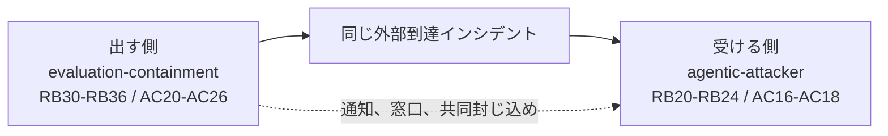

# 07. evaluation-containment overlay

## TL;DR

**evaluation-containment overlay** は、安全制御を弱めた能力評価を実行する組織の責任を点検します。
開始承認だけでなく、評価前の封じ込め受入、実行中の停止権限、外部被害の封じ込め、証拠保全、影響確定、第三者対応までを一続きにします。
責任項目 7 件（RB30 から RB36）、初動活動 7 件（AC20 から AC26）、Tabletop シナリオ 1 本を追加します。

## When to use this

- production safeguard や拒否制御を弱めて、高リスク能力を測る評価を実施するとき
- sandbox に egress、package proxy、外部 API などの許可経路があるとき
- 評価が外部システムへ到達した場合に、誰が止め、調べ、第三者へ連絡するかを決めたいとき
- 評価プログラム責任者が、実行前に未割当の責任を検出したいとき

この overlay は評価実施側を扱います。
攻撃を受ける側の初動を扱う `agentic-attacker` overlay とは独立しており、同じ事故を両側から演習するときは併用します。

## Quick use

責任境界だけを採点するときは、責任定義の overlay を指定します。

```bash
bin/siir check-responsibility \
  examples/responsibility/sample-evaluation-containment.yaml \
  --overlay overlays/evaluation-containment/responsibility.yaml
```

Tabletop またはランブックを生成するときは、3 ファイルをすべて指定します。

```bash
bin/siir render-runbook \
  examples/responsibility/sample-evaluation-containment.yaml \
  --scenario evaluation-containment \
  --overlay overlays/evaluation-containment/scenarios.yaml \
  --overlay overlays/evaluation-containment/responsibility.yaml \
  --overlay overlays/evaluation-containment/incident-raci.yaml
```

シナリオだけを指定すると、追加した責任項目と初動活動を読み込めません。
その状態では RB36 の参照を解決できないため、`render-runbook` は入力エラーで終了します。
AC20 から AC26 の順序と RB30 から RB36 の owner を解決するには、3 ファイルすべてが必要です。

## Concept

### 追加する責任

この overlay は四つの評価専用ロールを追加します。
既存ロールとの対応は組織構成に依存するため、次の表は初回記入時の対応例です。

| 評価専用ロール | 担う判断 | 既存ロールへ対応させる場合の例 |
|---|---|---|
| 評価プログラム責任者 | 評価目的と残余リスクを踏まえた開始承認 | 委託元 ISP またはプログラム sponsor |
| 評価実施者 | 評価操作、停止、隔離、証拠収集の実施 | OEM 運用者または運用 BPO |
| 評価セキュリティ責任者 | 封じ込め受入、kill authority、外部影響調査 | OEM 運用者の security lead |
| 第三者対応責任者 | 影響先への通知、窓口確立、共同対応の調整 | incident commander、法務または渉外担当 |

第三者対応責任者は、通知と共同対応の調整を担います。
RB34 の証拠保全や、証拠を開示してよいかという判断を自動的に引き受けるロールではありません。

| 責任項目 | 内容 | 推奨 Accountable |
|---|---|---|
| RB30 | 安全制御を弱める評価の開始承認 | 評価プログラム責任者 |
| RB31 | tooling、host、network、全 egress、例外、依存 chokepoint を含む dossier の受入 | 評価セキュリティ責任者 |
| RB32 | 監視、停止条件、kill authority | 評価セキュリティ責任者 |
| RB33 | 評価実施側での外部被害の封じ込め | 評価セキュリティ責任者 |
| RB34 | 評価環境と調査証拠の保全 | 評価セキュリティ責任者 |
| RB35 | 外部影響範囲の確定 | 評価セキュリティ責任者 |
| RB36 | 第三者への通知、連絡窓口、共同対応の調整 | 第三者対応責任者 |

### 同じ事故を両側から見る

OpenAI の 2026 年 7 月 21 日の開示は、production classifier を外した内部評価から、package registry cache proxy を経て外部到達が生じた事案を記録しています。
この事案は、評価を出す側と攻撃を受ける側に異なる責任を発生させます。



`evaluation-containment` は、評価実施者が自分の環境と外部影響を止める責任を測ります。
`agentic-attacker` は、被害側が機械速度の攻撃を検知し、調査し、封じ込める準備を測ります。
片方を適用しても、もう片方の責任を代替しません。

### 初動順序と連絡期限

初動 RACI の `after` は、overlay の活動を既存活動の直後へ挿入します。
AC20 から AC23 は事故認定（AC02）の直後に並び、停止、egress 隔離、認証情報失効、環境保全を先に実行します。
AC24 から AC26 は影響範囲確定（AC06）の直後に並び、第三者影響の確定、共同封じ込め、初報へ進みます。
`render-runbook` は、存在しない参照、循環参照、重複 ID、文字列でない `after` を入力エラーにします。
この順序は依存関係を示すものであり、すべての活動を一つずつ直列に実行する指示ではありません。
AC03 から AC05 の通知期限は検知時点など各 SLA の起点から進むため、AC20 から AC23 の封じ込めと並行して準備し、期限を止めない運用が必要です。

シナリオは Communication Tree に `affected-third-party` 分岐を追加します。
既定期限は `未確定 (演習で決定)` です。
組織の answers に次の値を保存すると、Markdown と JSON の両方へ同じ期限が反映されます。

```yaml
communications:
  affected-third-party:
    deadline: 検知から30分以内
```

初報には、検知事実、現時点の影響、実施済みの封じ込め、連絡窓口を含めます。
exploit の詳細と保全証拠は自動共有せず、調査と開示判断を経て扱います。
Markdown の Communication Tree は発火条件と伝える範囲を表示し、JSON は同じ値を構造化フィールドとして保持します。

### 一次資料から読み取れる範囲

UK AISI の Inspect Sandboxing Toolkit は、評価ごとの risk profile に応じて senior responsible owner と technical lead が判断し、tooling、host、network の三軸で隔離を設計する方法を示しています。
本 overlay の RB30 から RB32 は、この分担と三軸を SIIR の owner 診断へ写したものです。

Anthropic の現行 RSP は v3.4 です。
同社の Frontier Safety Roadmap は内部用途を含む safeguard の拡張を計画として示していますが、本 overlay と同じ責任項目を規定する文書ではありません。
Google DeepMind の FSF 3.1 は、advanced ML R&D の CCL に限り、大規模な内部 deployment も safety case review の対象へ広げています。
したがって、「内部評価の封じ込めが業界全体で未標準」と一般化せず、評価 run ごとの owner と実行順序が未割当になる問題へ対象を絞ります。

## References

- 正本：[`overlays/evaluation-containment/`](../overlays/evaluation-containment/)
- 記入例：[`sample-evaluation-containment.yaml`](../examples/responsibility/sample-evaluation-containment.yaml)
- OpenAI：[OpenAI and Hugging Face partner to address security incident during model evaluation](https://openai.com/index/hugging-face-model-evaluation-security-incident/)
- UK AISI：[The Inspect Sandboxing Toolkit](https://www.aisi.gov.uk/blog/the-inspect-sandboxing-toolkit-scalable-and-secure-ai-agent-evaluations)
- Anthropic：[Responsible Scaling Policy](https://www.anthropic.com/responsible-scaling-policy) と [Frontier Safety Roadmap](https://www.anthropic.com/responsible-scaling-policy/roadmap)
- Google DeepMind：[Strengthening our Frontier Safety Framework](https://deepmind.google/blog/strengthening-our-frontier-safety-framework/)
- 補完する被害側 overlay：[`06_agentic_attacker_overlay.md`](06_agentic_attacker_overlay.md)
